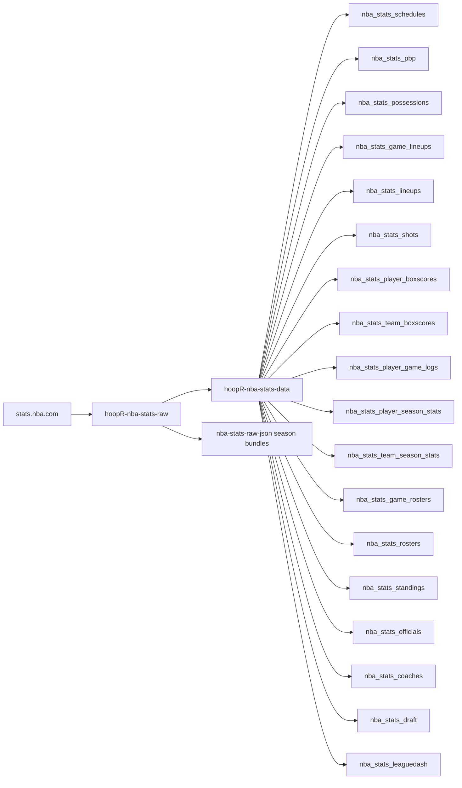
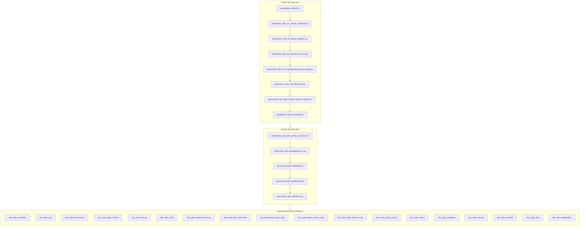

# hoopR-nba-stats-data

## hoopR NBA Stats workflow diagram

`scripts/daily_refresh.sh` (raw, droplet cron) and
`scripts/daily_nba_stats_python_processor.sh` (data) are the drivers; the raw side
also publishes whole-season JSON bundles to its own `nba-stats-raw-json` release.
Stage numbers are intended build order, not run order.

[hoopR-mbb-raw repository (source: ESPN)](https://github.com/sportsdataverse/hoopR-mbb-raw)

[hoopR-mbb-data repository (source: ESPN)](https://github.com/sportsdataverse/hoopR-mbb-data)

[hoopR-nba-raw repository (source: ESPN)](https://github.com/sportsdataverse/hoopR-nba-raw)

[hoopR-nba-data repository (source: ESPN)](https://github.com/sportsdataverse/hoopR-nba-data)

[hoopR-nba-stats-raw repository (source: NBA Stats)](https://github.com/sportsdataverse/hoopR-nba-stats-raw)

[hoopR-nba-stats-data repository (source: NBA Stats)](https://github.com/sportsdataverse/hoopR-nba-stats-data)

[ncaa-mbb-hoops-raw repository (source: stats.ncaa.org)](https://github.com/sportsdataverse/ncaa-mbb-hoops-raw)

[ncaa-mbb-hoops-data repository (source: stats.ncaa.org)](https://github.com/sportsdataverse/ncaa-mbb-hoops-data)

[hoopR-kp-data repository (source: KenPom, dormant)](https://github.com/sportsdataverse/hoopR-kp-data)

## Datasets

<!-- BEGIN GENERATED: datasets -->
| Script | Dataset | Release tag | Last published |
|---|---|---|---|
| [`python/nba_stats_01_standings_creation.py`](python/nba_stats_01_standings_creation.py) | [`standings`](docs/datasets/standings.md) | [`nba_stats_standings`](https://github.com/sportsdataverse/sportsdataverse-data/releases/tag/nba_stats_standings) | 2026-07-24 |
| [`python/nba_stats_02_player_season_stats_creation.py`](python/nba_stats_02_player_season_stats_creation.py) | [`player_season_stats`](docs/datasets/player_season_stats.md) | [`nba_stats_player_season_stats`](https://github.com/sportsdataverse/sportsdataverse-data/releases/tag/nba_stats_player_season_stats) | 2026-07-24 |
| [`python/nba_stats_03_team_season_stats_creation.py`](python/nba_stats_03_team_season_stats_creation.py) | [`team_season_stats`](docs/datasets/team_season_stats.md) | [`nba_stats_team_season_stats`](https://github.com/sportsdataverse/sportsdataverse-data/releases/tag/nba_stats_team_season_stats) | 2026-07-24 |
| [`python/nba_stats_04_lineups_creation.py`](python/nba_stats_04_lineups_creation.py) | [`lineups`](docs/datasets/lineups.md) | [`nba_stats_lineups`](https://github.com/sportsdataverse/sportsdataverse-data/releases/tag/nba_stats_lineups) | 2026-07-24 |
| [`python/nba_stats_05_rosters_creation.py`](python/nba_stats_05_rosters_creation.py) | [`rosters`](docs/datasets/rosters.md) | [`nba_stats_rosters`](https://github.com/sportsdataverse/sportsdataverse-data/releases/tag/nba_stats_rosters) | 2026-07-24 |
| [`python/nba_stats_06_coaches_creation.py`](python/nba_stats_06_coaches_creation.py) | [`coaches`](docs/datasets/coaches.md) | [`nba_stats_coaches`](https://github.com/sportsdataverse/sportsdataverse-data/releases/tag/nba_stats_coaches) | 2026-07-24 |
| [`python/nba_stats_07_draft_creation.py`](python/nba_stats_07_draft_creation.py) | [`draft`](docs/datasets/draft.md) | [`nba_stats_draft`](https://github.com/sportsdataverse/sportsdataverse-data/releases/tag/nba_stats_draft) | 2026-08-12 |
| [`python/nba_stats_08_schedules_creation.py`](python/nba_stats_08_schedules_creation.py) | [`schedules`](docs/datasets/schedules.md) | [`nba_stats_schedules`](https://github.com/sportsdataverse/sportsdataverse-data/releases/tag/nba_stats_schedules) | 2026-08-13 |
| [`python/nba_stats_09_player_game_logs_creation.py`](python/nba_stats_09_player_game_logs_creation.py) | [`player_game_logs`](docs/datasets/player_game_logs.md) | [`nba_stats_player_game_logs`](https://github.com/sportsdataverse/sportsdataverse-data/releases/tag/nba_stats_player_game_logs) | 2026-07-24 |
| [`python/nba_stats_10_pbp_creation.py`](python/nba_stats_10_pbp_creation.py) | [`pbp`](docs/datasets/pbp.md) | [`nba_stats_pbp`](https://github.com/sportsdataverse/sportsdataverse-data/releases/tag/nba_stats_pbp) | 2026-08-13 |
| [`python/nba_stats_11_game_rosters_creation.py`](python/nba_stats_11_game_rosters_creation.py) | [`game_rosters`](docs/datasets/game_rosters.md) | [`nba_stats_game_rosters`](https://github.com/sportsdataverse/sportsdataverse-data/releases/tag/nba_stats_game_rosters) | 2026-07-24 |
| [`python/nba_stats_12_officials_creation.py`](python/nba_stats_12_officials_creation.py) | [`officials`](docs/datasets/officials.md) | [`nba_stats_officials`](https://github.com/sportsdataverse/sportsdataverse-data/releases/tag/nba_stats_officials) | 2026-07-24 |
| [`python/nba_stats_13_player_boxscores_creation.py`](python/nba_stats_13_player_boxscores_creation.py) | [`player_boxscores`](docs/datasets/player_boxscores.md) | [`nba_stats_player_boxscores`](https://github.com/sportsdataverse/sportsdataverse-data/releases/tag/nba_stats_player_boxscores) | 2026-07-24 |
| [`python/nba_stats_14_team_boxscores_creation.py`](python/nba_stats_14_team_boxscores_creation.py) | [`team_boxscores`](docs/datasets/team_boxscores.md) | [`nba_stats_team_boxscores`](https://github.com/sportsdataverse/sportsdataverse-data/releases/tag/nba_stats_team_boxscores) | 2026-07-24 |
| [`python/nba_stats_15_shots_creation.py`](python/nba_stats_15_shots_creation.py) | [`shots`](docs/datasets/shots.md) | [`nba_stats_shots`](https://github.com/sportsdataverse/sportsdataverse-data/releases/tag/nba_stats_shots) | 2026-07-24 |
| [`python/nba_stats_99_schedule_master_creation.py`](python/nba_stats_99_schedule_master_creation.py) | [`schedule_master`](docs/datasets/schedule_master.md) | `nba_stats/nba_stats_schedule_master.parquet` (committed) | — |
| [`python/nba_stats_99_schedule_master_creation.py`](python/nba_stats_99_schedule_master_creation.py) | [`games_in_data_repo`](docs/datasets/games_in_data_repo.md) | `nba_stats/nba_stats_games_in_data_repo.parquet` (committed) | — |
<!-- END GENERATED: datasets -->

## Reports & explainers

<!-- BEGIN GENERATED: reports -->

| Report | What it is | Last updated |
|---|---|---|
| [Model registry](models/REGISTRY.md) | model | artifact | gates | retrain, one row per published model | 2026-09-01 |
| [Model reports & cards](docs/models/) | 1 files, one per item | 2026-09-01 |
| [Dataset docs (column-level, generated)](docs/datasets/) | 17 files, one per item | 2026-08-13 |
| [DONE: `nba_stats_draft` (Phase 3) — published 2026-08-12](docs/nba-draft-todo.md) | explainer | 2026-08-12 |
| [NBA Stats v3 reshaper — implementation plan](docs/nba-reshaper-port-plan.md) | explainer | 2026-07-28 |
| [NBA Stats reshaper port — scope](docs/nba-reshaper-port-scope.md) | explainer | 2026-07-23 |
| [NBA Stats v3 reshaper — tag manifest (Phase 0, Task 0.1)](docs/nba-tag-manifest.md) | explainer | 2026-07-28 |
| [NBA v3 raw-store coverage probe](docs/nba-v3-coverage.md) | explainer | 2026-08-13 |
| [NBA player-impact backfill — completion handoff](docs/WARM_HANDOFF.md) | explainer | 2026-08-13 |

<!-- END GENERATED: reports -->

## Automation & status

<!-- BEGIN GENERATED: status -->

| workflow | schedule | last run |
|---|---|---|
|  | day 27 08:00 UTC in Jun; day 29 08:00 UTC in Jun | never run |
|  | days 18-31 07:00 UTC in Oct; daily 07:00 UTC in Nov-Dec; daily 07:00 UTC in Jan-Jun; days 1-12 07:00 UTC in Jul | 2026-07-12 |
|  | on dispatch | never run |
|  | on push / dispatch | 2026-08-19 |
|  | on push / PR / dispatch | 2026-08-28 |

| release tag | assets | size | last publish |
|---|---:|---:|---|
| [`nba_stats_coaches`](https://github.com/sportsdataverse/sportsdataverse-data/releases/tag/nba_stats_coaches) | 90 | 0.8 MB | 2026-08-13 |
| [`nba_stats_draft`](https://github.com/sportsdataverse/sportsdataverse-data/releases/tag/nba_stats_draft) | 90 | 0.5 MB | 2026-08-13 |
| [`nba_stats_game_lineups`](https://github.com/sportsdataverse/sportsdataverse-data/releases/tag/nba_stats_game_lineups) | 91 | 93.5 MB | 2026-08-13 |
| [`nba_stats_game_rosters`](https://github.com/sportsdataverse/sportsdataverse-data/releases/tag/nba_stats_game_rosters) | 90 | 12.8 MB | 2026-08-13 |
| [`nba_stats_leaguedash`](https://github.com/sportsdataverse/sportsdataverse-data/releases/tag/nba_stats_leaguedash) | 833 | 284.2 MB | 2026-08-13 |
| [`nba_stats_lineups`](https://github.com/sportsdataverse/sportsdataverse-data/releases/tag/nba_stats_lineups) | 57 | 453.3 MB | 2026-08-13 |
| [`nba_stats_officials`](https://github.com/sportsdataverse/sportsdataverse-data/releases/tag/nba_stats_officials) | 90 | 4.3 MB | 2026-08-13 |
| [`nba_stats_pbp`](https://github.com/sportsdataverse/sportsdataverse-data/releases/tag/nba_stats_pbp) | 181 | 4,795.6 MB | 2026-08-13 |
| [`nba_stats_player_boxscores`](https://github.com/sportsdataverse/sportsdataverse-data/releases/tag/nba_stats_player_boxscores) | 90 | 187.8 MB | 2026-08-13 |
| [`nba_stats_player_game_logs`](https://github.com/sportsdataverse/sportsdataverse-data/releases/tag/nba_stats_player_game_logs) | 90 | 16.3 MB | 2026-08-13 |
| [`nba_stats_player_season_stats`](https://github.com/sportsdataverse/sportsdataverse-data/releases/tag/nba_stats_player_season_stats) | 90 | 127.4 MB | 2026-08-13 |
| [`nba_stats_possessions`](https://github.com/sportsdataverse/sportsdataverse-data/releases/tag/nba_stats_possessions) | 91 | 310.5 MB | 2026-08-13 |
| [`nba_stats_rosters`](https://github.com/sportsdataverse/sportsdataverse-data/releases/tag/nba_stats_rosters) | 90 | 2.7 MB | 2026-08-13 |
| [`nba_stats_schedules`](https://github.com/sportsdataverse/sportsdataverse-data/releases/tag/nba_stats_schedules) | 188 | 19.0 MB | 2026-08-13 |
| [`nba_stats_shots`](https://github.com/sportsdataverse/sportsdataverse-data/releases/tag/nba_stats_shots) | 90 | 1,070.5 MB | 2026-08-13 |
| [`nba_stats_standings`](https://github.com/sportsdataverse/sportsdataverse-data/releases/tag/nba_stats_standings) | 90 | 1.6 MB | 2026-08-13 |
| [`nba_stats_team_boxscores`](https://github.com/sportsdataverse/sportsdataverse-data/releases/tag/nba_stats_team_boxscores) | 90 | 12.2 MB | 2026-08-13 |
| [`nba_stats_team_season_stats`](https://github.com/sportsdataverse/sportsdataverse-data/releases/tag/nba_stats_team_season_stats) | 90 | 9.3 MB | 2026-08-13 |

<!-- END GENERATED: status -->
