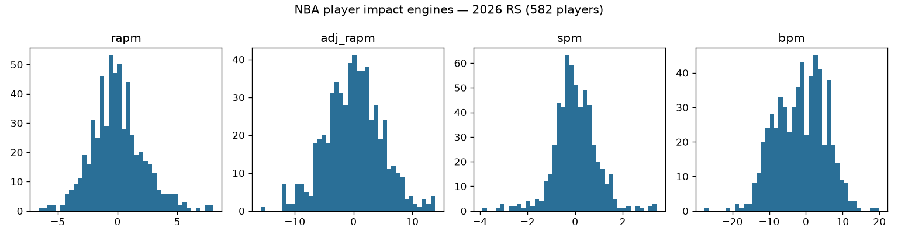
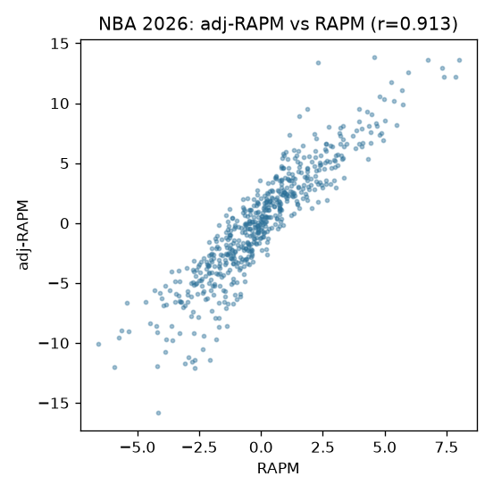
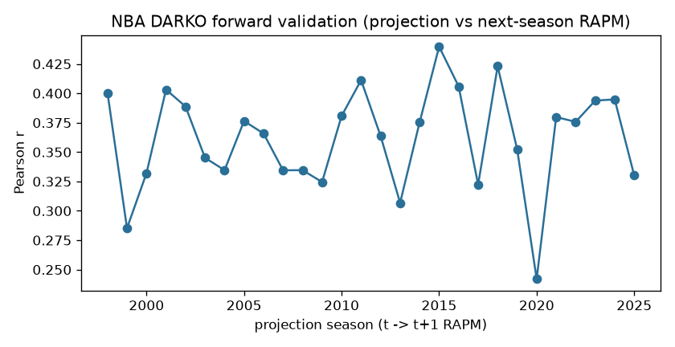

# NBA player impact — model documentation

Consolidated per-season player-impact suite published to `nba_player_impact`
(per-season parquet/csv/rds + a `nba_player_impact_card.json` provenance
sidecar on every publish — the card is the per-run metadata authority).

## Engines (columns by family)

| engine | what it contributes |
|---|---|
| RAPM | possession on/off ridge (o_rapm / d_rapm / rapm) |
| adj-RAPM | RAPM with an SPM-derived prior (previous season's RS+PO blend) |
| SPM | box-score plus/minus, coefficients fit on RS RAPM targets |
| BPM 2.0 | box logs + listed positions |
| DARKO-style | cross-season Kalman filter + aging curve (projects next season) |
| WAR | RAPM rating x calibrated pts-per-win, replacement level -2.0 |

Substrates: the committed `hoopR`-stats raw store (possessions
compile + leaguegamelog / playerindex / leaguedashplayerbiostats captures) —
offline and clone-free via the URL store backend.

## Pipeline

Per-engine numbered stages `nba_model_01_possessions` … `nba_model_07_darko`
(parquet handoffs under `build_out/impact_engines/`; hermetic stub tests cover
the chain including cross-season prior threading) with the consolidated
build+publish as `nba_model_08_impact`. Retrain is dispatch-only BY DESIGN
(rate-budgeted long build; `dry_run` defaults true). Full-history backfills run from the droplet (`scripts/run_impact_backfill.sh` after `scripts/hydrate_raw_store.sh`); the per-file URL store backend suits a refresh, not a backfill.

## Results / validation

Proxy-validated against the published RAPM/EPM oracle CSVs: the engines beat
the minutes-played baseline by ~10% on the proxy tasks; per-run diagnostics
live in the release card sidecar. Numeric publish-blocking floors are a
recorded TODO in `models/REGISTRY.md` (stated, not yet encoded).

## Data

Every substrate comes from the committed `hoopR-nba-stats-raw` store (per-game
playbyplay/rotation/boxscore payloads plus the season-level leaguegamelog /
playerindex / leaguedashplayerbiostats captures), read offline through the
raw-store backend — `readonly` means OFFLINE: a store miss raises rather than
silently completing over the network, so a build is reproducible or loudly
incomplete, never quietly mixed.

## Methodology

Seasons run earliest-to-latest because two engines carry state forward:

1. **RAPM** — possession on/off ridge per season and season type.
2. **SPM** — box-score features regressed onto that season's RS RAPM
   (coefficients fit ONCE on the regular season; the playoff pass reuses
   them — a ~15-game playoff sample would train noise on noise).
3. **adj-RAPM** — RAPM re-fit with an SPM-derived prior: the PREVIOUS
   season's possession-weighted RS+PO SPM blend for the regular season, this
   season's RS SPM for the playoffs. A gap season deliberately breaks the
   prior chain.
4. **BPM 2.0** — box logs + listed positions.
5. **DARKO-style** — a per-season Kalman filter over the RAPM panel with an
   aging curve, projecting NEXT season; playoff form enters as a
   possession-weighted blend rather than a second time step (a second step
   would apply a season of aging twice).
6. **WAR** — RAPM rating x pts-per-win calibrated from that season's team
   logs, replacement level -2.0 per 100.

## Feature engineering

The heavy lifting is the possession compile (lineup reconstruction with
rotation fallbacks) and the box-feature substrate; per-engine stages
(`nba_model_01_possessions` … `07_darko`) expose each step with parquet
handoffs so one engine can be iterated without recomputing the other five.

## Limitations

The DARKO forward correlations below are honest but modest — next-season RAPM
is itself a noisy target, so the ceiling on this metric is well below 1 even
for a perfect projection. Engines share the possession substrate, so a lineup
reconstruction error propagates to all of them; numeric publish-blocking
floors remain a stated TODO in `models/REGISTRY.md`.

## Evaluation on the published releases (2026-09-01)

Computed from the released `nba_player_impact_{season}.parquet` assets (30 seasons, 1997-2026).

- adj-RAPM vs RAPM agreement (2026 RS): Pearson r = 0.913
- **DARKO forward validation** (projection in season t vs realized t+1 RAPM — out-of-sample by construction): weighted mean r = 0.362 over 28 season pairs

| projection season | n joined | Pearson r | MAE |
|---|---|---|---|
| 2016 -> 2017 | 386 | 0.406 | 1.58 |
| 2017 -> 2018 | 392 | 0.322 | 1.93 |
| 2018 -> 2019 | 412 | 0.423 | 1.46 |
| 2019 -> 2020 | 400 | 0.352 | 1.06 |
| 2020 -> 2021 | 435 | 0.242 | 1.07 |
| 2021 -> 2022 | 450 | 0.380 | 1.02 |
| 2022 -> 2023 | 433 | 0.376 | 1.03 |
| 2023 -> 2024 | 450 | 0.394 | 1.06 |
| 2024 -> 2025 | 447 | 0.395 | 1.04 |
| 2025 -> 2026 | 464 | 0.330 | 1.71 |

Card: [`nba_player_impact_eval_card.json`](nba_player_impact_eval_card.json)

## Figures

## Avenues for improvement & open issues

- **Encode the numeric publish floors** — the registry states them as TODO;
  the proxy-validation deltas measured here are exactly the values to freeze.
- **Uncertainty** — none of the engines ships an interval; a
  cluster-respecting resample (games, not rows) is the recorded standard.
- **DARKO ceiling** — the forward-r is capped by RAPM noise in the target;
  validating against a multi-season blended target would separate projection
  error from target noise.
- **PlayIn season type is unsupported** by design; revisit if the sample ever
  matters.
- **Known issue:** the `gamerotation` capture family is PARKED upstream; where rotation data is absent the lineup fallback carries more reconstruction noise into every engine.
