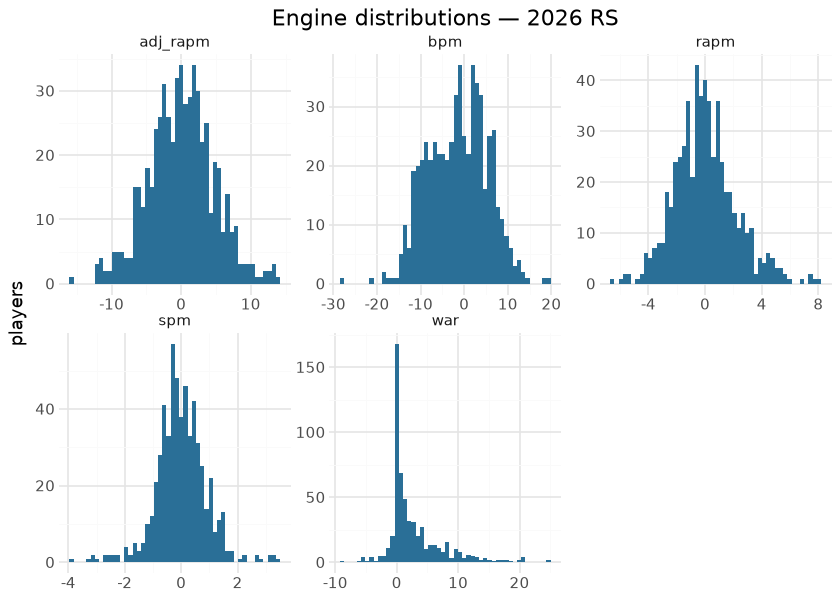
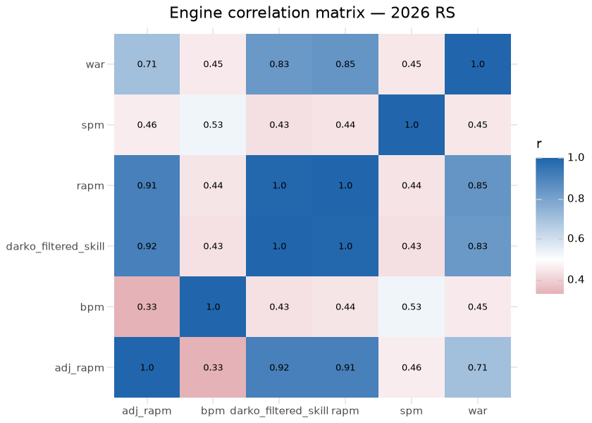

# NBA player impact — the six-engine suite

The consolidated player-impact suite publishes one row per player-season
(regular season and playoffs) on the `nba_player_impact` release tag,
with six engines’ columns side by side:

| engine | what it contributes |
|----|----|
| RAPM | possession on/off ridge (`o_rapm` / `d_rapm` / `rapm`) |
| adj-RAPM | RAPM with an SPM-derived prior (previous season’s RS+PO blend) |
| SPM | box-score plus/minus, coefficients fit on RS RAPM targets |
| BPM 2.0 | box logs + listed positions (`obpm` / `dbpm` / `bpm`) |
| DARKO-style | cross-season Kalman filter + aging curve (projects next season) |
| WAR | RAPM rating × calibrated pts-per-win, replacement level −2.0 |

Seasons build earliest-to-latest because two engines carry state
forward: SPM coefficients are fit ONCE per season on regular-season RAPM
(a ~15-game playoff sample would train noise on noise), and adj-RAPM’s
prior is the *previous* season’s possession-weighted RS+PO SPM blend — a
gap season deliberately breaks the prior chain. DARKO runs a per-season
Kalman step over the RAPM panel with an aging curve; playoff form enters
as a possession-weighted blend rather than a second time step, because a
second step would apply a season of aging twice.

The substrate is the committed `hoopR-nba-stats-raw` store (per-game
playbyplay / rotation / boxscore payloads plus season-level captures),
read offline through the raw-store backend — `readonly` means OFFLINE: a
store miss raises rather than silently completing over the network, so a
build is reproducible or loudly incomplete, never quietly mixed. This
document, by contrast, evaluates the **published releases**: every
number and figure below is recomputed at render time from the release
assets themselves, which is exactly what a consumer downloads.

## Training data

| Published nba_player_impact assets — last 12 of 30 seasons (1997–2026) |  |  |  |
|----|----|----|----|
| one row per player-season-seasontype; computed at render time from the release |  |  |  |
| season | player_rows | playoff_rows | off_possessions |
| 2015 | 700 | 208 | 1,244,400 |
| 2016 | 691 | 215 | 1,268,870 |
| 2017 | 701 | 215 | 1,267,830 |
| 2018 | 752 | 210 | 1,275,365 |
| 2019 | 742 | 212 | 1,312,800 |
| 2020 | 744 | 215 | 1,145,775 |
| 2021 | 779 | 239 | 1,153,500 |
| 2022 | 820 | 215 | 1,291,255 |
| 2023 | 756 | 217 | 1,303,355 |
| 2024 | 786 | 214 | 1,289,125 |
| 2025 | 788 | 219 | 1,299,230 |
| 2026 | 812 | 230 | 1,309,825 |

&#10;

## Exploratory data analysis

The correlation matrix is the suite’s honesty check: RAPM and adj-RAPM
agree strongly (the prior stabilizes, it does not overwrite), box
engines (SPM, BPM) form their own cluster, and DARKO’s filtered skill —
which sees every prior season — correlates with everything while
duplicating nothing.

## Attribution

The engines are linear models (ridge, regression, Kalman), so
attribution is native: each engine’s O/D split *is* its decomposition,
and the published columns carry it (`o_rapm`/`d_rapm`, `ospm`/`dspm`,
`obpm`/`dbpm`, `o_adj_rapm`/`d_adj_rapm`). No SHAP approximation is
needed — the columns are the exact attributions. What the release does
*not* carry is the SPM coefficient vector itself (it lives in the build
artifacts under `build_out/impact_engines/`), an omission recorded in
the avenues below.

## Evaluation

**DARKO forward validation** is the suite’s headline out-of-sample test:
the projection made in season t (`darko_projected_rating`, which sees
nothing after t) against the realized RAPM in season t+1. Recomputed at
render time over every adjacent published season pair:

| DARKO forward validation — projection (t) vs realized RAPM (t+1) |  |  |  |
|----|----|----|----|
| out-of-sample by construction; weighted mean r = 0.362 over 28 season pairs |  |  |  |
| season | pearson | MAE | n |
| 2014 | 0.375 | 1.901 | 395 |
| 2015 | 0.440 | 1.550 | 396 |
| 2016 | 0.406 | 1.583 | 386 |
| 2017 | 0.322 | 1.930 | 392 |
| 2018 | 0.423 | 1.456 | 412 |
| 2019 | 0.352 | 1.061 | 400 |
| 2020 | 0.242 | 1.069 | 435 |
| 2021 | 0.380 | 1.019 | 450 |
| 2022 | 0.376 | 1.035 | 433 |
| 2023 | 0.394 | 1.058 | 450 |
| 2024 | 0.395 | 1.041 | 447 |
| 2025 | 0.330 | 1.707 | 464 |

&#10;

| Reliability context for the forward validation |  |  |
|----|----|----|
| the projection's ceiling is bounded by how noisy the RAPM target itself is |  |  |
| check | pearson | pairs |
| RAPM year-over-year reliability (same player, adjacent seasons) | 0.357 | 11272 |
| adj-RAPM vs RAPM agreement (2026 RS) | 0.913 | 582 |

&#10;

The forward-r is honest but modest, and the reliability row is why:
DARKO cannot correlate with next-season RAPM more than next-season RAPM
correlates with anything stable. The engines were additionally
proxy-validated against the published RAPM/EPM oracle CSVs at build time
(beating the minutes-played baseline by ~10%); numeric publish-blocking
floors remain a recorded TODO in `models/REGISTRY.md`.

## Results

| Top 15 by WAR — 2026 regular season (min 500 minutes) |  |  |  |  |  |  |  |  |
|----|----|----|----|----|----|----|----|----|
|  | Player | Team | GP | Min | RAPM | adj-RAPM | BPM | WAR |
|  | Shai Gilgeous-Alexander | OKC | 68 | 2,261 | 8.00 | 13.64 | 19.79 | 24.89 |
|  | Dyson Daniels | ATL | 76 | 2,523 | 6.73 | 13.63 | 3.34 | 24.82 |
|  | Chet Holmgren | OKC | 69 | 1,997 | 7.38 | 12.21 | 12.41 | 20.90 |
|  | Kawhi Leonard | LAC | 65 | 2,087 | 7.32 | 12.93 | 6.75 | 20.82 |
|  | Derrick White | BOS | 77 | 2,623 | 5.49 | 8.16 | 9.65 | 20.82 |
|  | Victor Wembanyama | SAS | 64 | 1,867 | 7.87 | 12.19 | 14.34 | 20.43 |
|  | Amen Thompson | HOU | 79 | 2,954 | 4.35 | 8.07 | 7.21 | 19.94 |
|  | Bam Adebayo | MIA | 73 | 2,363 | 5.37 | 10.15 | 2.55 | 19.79 |
|  | Nikola Jokić | DEN | 65 | 2,265 | 5.74 | 9.90 | 18.00 | 18.85 |
|  | Donovan Mitchell | CLE | 70 | 2,341 | 4.81 | 7.38 | 7.75 | 17.99 |
|  | Nickeil Alexander-Walker | ATL | 78 | 2,603 | 3.98 | 8.45 | 2.51 | 17.77 |
|  | Julian Champagnie | SAS | 82 | 2,267 | 4.88 | 7.52 | 7.19 | 17.33 |
|  | Donte DiVincenzo | MIN | 82 | 2,497 | 4.07 | 6.38 | 3.90 | 16.87 |
|  | Cade Cunningham | DET | 64 | 2,172 | 5.02 | 8.58 | 12.94 | 16.71 |
|  | Devin Booker | PHX | 64 | 2,148 | 4.96 | 10.32 | 3.38 | 16.26 |

&#10;

## Provenance & reproducibility

- **Trained on:** the committed `hoopR-nba-stats-raw` store (possession
  compile from per-game playbyplay/rotation/boxscore + season-level
  leaguegamelog / playerindex / leaguedashplayerbiostats captures),
  seasons 1997–2026 (the corpus table above lists what the release
  carries), read offline through the raw-store backend.
- **Pipeline:** per-engine numbered stages `nba_model_01_possessions` …
  `nba_model_07_darko` (parquet handoffs under
  `build_out/impact_engines/`; hermetic stub tests cover the chain
  including cross-season prior threading), consolidated build+publish as
  `nba_model_08_impact`. Retrain is dispatch-only BY DESIGN
  (rate-budgeted; `dry_run` defaults true); full-history backfills run
  from the droplet. Single home: `models/manifest.yaml`.
- **This document** evaluates the published `nba_player_impact` release
  assets downloaded at render time — the exact frames consumers read.
- **Rebuild:** `scripts/render_model_docs.sh` (Quarto → GFM;
  `uv sync --group docs`). Requires network for the release download and
  the headshot CDN.

## Avenues for improvement & open issues

- **Encode the numeric publish floors** — the registry states them as
  TODO; the proxy-validation deltas are exactly the values to freeze.
- **Publish the SPM coefficient vector** — the release carries the
  engine outputs but not the fitted coefficients; shipping them (or a
  per-retrain meta sidecar) would let this document show real
  coefficient importance instead of describing where it lives.
- **Uncertainty** — none of the engines ships an interval; a
  cluster-respecting resample (games, not rows) is the recorded
  standard.
- **DARKO ceiling** — the forward-r is capped by RAPM noise in the
  target; validating against a multi-season blended target would
  separate projection error from target noise.
- **PlayIn season type is unsupported** by design; revisit if the sample
  ever justifies it.
