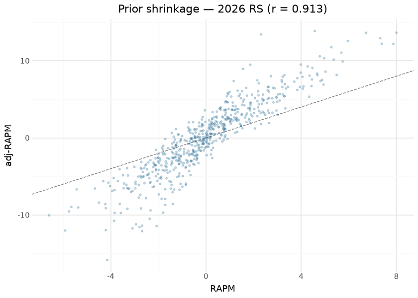
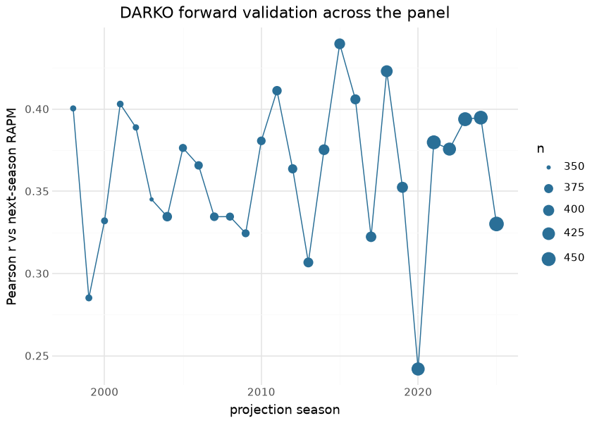

# NBA player impact — the six-engine suite

The consolidated player-impact suite publishes one row per player-season
(regular season and playoffs) on the `nba_player_impact` release tag,
with six engines’ columns side by side:

| engine | what it contributes |
|----|----|
| RAPM | possession on/off ridge (`o_rapm` / `d_rapm` / `rapm`) |
| adj-RAPM | RAPM with an SPM-derived prior (previous season’s RS+PO blend) |
| SPM | box-score plus/minus, coefficients fit on RS RAPM targets |
| BPM 2.0 | box logs + listed positions (`obpm` / `dbpm` / `bpm`) |
| DARKO-style | cross-season Kalman filter + aging curve (projects next season) |
| WAR | RAPM rating × calibrated pts-per-win, replacement level −2.0 |

Seasons build earliest-to-latest because two engines carry state
forward: SPM coefficients are fit ONCE per season on regular-season RAPM
(a ~15-game playoff sample would train noise on noise), and adj-RAPM’s
prior is the *previous* season’s possession-weighted RS+PO SPM blend — a
gap season deliberately breaks the prior chain. DARKO runs a per-season
Kalman step over the RAPM panel with an aging curve; playoff form enters
as a possession-weighted blend rather than a second time step, because a
second step would apply a season of aging twice.

The substrate is the committed `hoopR-nba-stats-raw` store (per-game
playbyplay / rotation / boxscore payloads plus season-level captures),
read offline through the raw-store backend — `readonly` means OFFLINE: a
store miss raises rather than silently completing over the network, so a
build is reproducible or loudly incomplete, never quietly mixed. This
document, by contrast, evaluates the **published releases**: every
number and figure below is recomputed at render time from the release
assets themselves, which is exactly what a consumer downloads.

## Training data

| Published nba_player_impact assets — last 12 of 30 seasons (1997–2026) |  |  |  |
|----|----|----|----|
| one row per player-season-seasontype; computed at render time from the release |  |  |  |
| season | player_rows | playoff_rows | off_possessions |
| 2015 | 700 | 208 | 1,244,400 |
| 2016 | 691 | 215 | 1,268,870 |
| 2017 | 701 | 215 | 1,267,830 |
| 2018 | 752 | 210 | 1,275,365 |
| 2019 | 742 | 212 | 1,312,800 |
| 2020 | 744 | 215 | 1,145,775 |
| 2021 | 779 | 239 | 1,153,500 |
| 2022 | 820 | 215 | 1,291,255 |
| 2023 | 756 | 217 | 1,303,355 |
| 2024 | 786 | 214 | 1,289,125 |
| 2025 | 788 | 219 | 1,299,230 |
| 2026 | 812 | 230 | 1,309,825 |

&#10;

## Exploratory data analysis

The correlation matrix is the suite’s honesty check: RAPM and adj-RAPM
agree strongly (the prior stabilizes, it does not overwrite), box
engines (SPM, BPM) form their own cluster, and DARKO’s filtered skill —
which sees every prior season — correlates with everything while
duplicating nothing.

## Attribution

The engines are linear models (ridge, regression, Kalman), so
attribution is native: each engine’s O/D split *is* its decomposition,
and the published columns carry it (`o_rapm`/`d_rapm`, `ospm`/`dspm`,
`obpm`/`dbpm`, `o_adj_rapm`/`d_adj_rapm`). No SHAP approximation is
needed — the columns are the exact attributions.

The SPM coefficient vector itself now ships as an additive sidecar,
`nba_player_impact_spm_coefficients.json`: one record per season with
the offense and defense ridge coefficients, the feature names, the fit
population’s per-100 feature standard deviations, and the train-time fit
metrics. So this section shows the fitted model rather than describing
where it lives.

| Fitted SPM coefficients — 2026 (ridge, alpha = 100) |  |  |  |  |  |
|----|----|----|----|----|----|
| source: repo copy (nba_player_impact_spm_coefficients.json); fit on 582 regular-season players, train r(spm, rapm) = 0.437 |  |  |  |  |  |
| feature | o_coef | d_coef | feature SD | \|o_coef\|×SD | \|d_coef\|×SD |
| pts | 0.136 | 0.008 | 7.298 | 0.996 | 0.057 |
| fga | −0.060 | −0.024 | 4.968 | 0.298 | 0.121 |
| ast | 0.094 | 0.025 | 2.710 | 0.254 | 0.067 |
| tov | −0.177 | −0.063 | 1.287 | 0.228 | 0.081 |
| oreb | 0.056 | 0.050 | 1.897 | 0.106 | 0.096 |
| dreb | 0.036 | 0.082 | 2.746 | 0.098 | 0.225 |
| blk | −0.083 | 0.228 | 0.951 | 0.079 | 0.217 |
| pf | −0.019 | −0.055 | 1.643 | 0.031 | 0.090 |
| stl | 0.024 | 0.245 | 0.878 | 0.021 | 0.215 |
| fg3m | 0.009 | 0.082 | 1.568 | 0.013 | 0.129 |
| fta | −0.004 | −0.017 | 2.889 | 0.013 | 0.048 |

&#10;

The sidecar is reproducible from the published data itself: refitting
each season on its released `o_rapm`/`d_rapm` target plus the same
committed box logs recovers the published `spm` column exactly in 29 of
30 seasons (max absolute difference 0.0; 2005 differs by 0.158 at the
extreme, r = 0.999962 — a box-log difference in that one season,
recorded rather than smoothed over). That check is stored per record as
`reproduces_published_spm_r`, so a refit that did *not* reproduce the
release would show up in the artifact instead of passing silently.

## Evaluation

**DARKO forward validation** is the suite’s headline out-of-sample test:
the projection made in season t (`darko_projected_rating`, which sees
nothing after t) against the realized RAPM in season t+1. Recomputed at
render time over every adjacent published season pair:

| DARKO forward validation — projection (t) vs realized RAPM (t+1) |  |  |  |
|----|----|----|----|
| out-of-sample by construction; weighted mean r = 0.362 over 28 season pairs |  |  |  |
| season | pearson | MAE | n |
| 2014 | 0.375 | 1.901 | 395 |
| 2015 | 0.440 | 1.550 | 396 |
| 2016 | 0.406 | 1.583 | 386 |
| 2017 | 0.322 | 1.930 | 392 |
| 2018 | 0.423 | 1.456 | 412 |
| 2019 | 0.352 | 1.061 | 400 |
| 2020 | 0.242 | 1.069 | 435 |
| 2021 | 0.380 | 1.019 | 450 |
| 2022 | 0.376 | 1.035 | 433 |
| 2023 | 0.394 | 1.058 | 450 |
| 2024 | 0.395 | 1.041 | 447 |
| 2025 | 0.330 | 1.707 | 464 |

&#10;

| Reliability context for the forward validation |  |  |
|----|----|----|
| the projection's ceiling is bounded by how noisy the RAPM target itself is |  |  |
| check | pearson | pairs |
| RAPM year-over-year reliability (same player, adjacent seasons) | 0.357 | 11272 |
| adj-RAPM vs RAPM agreement (2026 RS) | 0.913 | 582 |

&#10;

The forward-r is honest but modest, and the reliability row is why:
DARKO cannot correlate with next-season RAPM more than next-season RAPM
correlates with anything stable.

### Separating projection error from target noise

A single season of RAPM is a noisy realization of a player’s true level,
so a low forward correlation confounds *the projection being wrong* with
*the target being noisy*. Averaging the target over more post-projection
seasons (possession-weighted) reduces the target’s noise without
touching the projection. Restricting all three rows to the **same**
player-seasons keeps the comparison honest — a longer target window
would otherwise also change the population:

| DARKO against a multi-season blended target |  |  |  |  |  |  |
|----|----|----|----|----|----|----|
| same player-seasons in every row; only the target's noise changes |  |  |  |  |  |  |
| target | n | r (DARKO) | r (carry-forward RAPM) | MAE (DARKO) | MAE (carry-forward) | sd_target |
| next season only | 7014 | 0.369 | 0.379 | 1.634 | 1.683 | 1.906 |
| 2-season RAPM | 7014 | 0.410 | 0.418 | 1.466 | 1.526 | 1.621 |
| 3-season RAPM | 7014 | 0.437 | 0.442 | 1.387 | 1.455 | 1.494 |

&#10;

Two readings, both worth stating plainly:

- **Most of the “modest” forward-r is target noise.** Holding the
  projection and the population fixed and only widening the target
  window lifts the correlation materially (≈0.37 → ≈0.44 from a
  one-season to a three-season target). The projection did not improve;
  the yardstick got less noisy.
- **The projection is not beating simple persistence on rank.** Carrying
  season-*t* RAPM forward unchanged correlates with every target about
  as well as the DARKO projection does (marginally better, in fact).
  Where the projection does earn its keep is **level**: its MAE is lower
  against every target, which is what shrinkage toward the aging-curve
  mean buys. Treat `darko_projected_rating` as a better-calibrated
  magnitude, not a better ordering — and the gap to persistence is the
  honest measure of what the Kalman step is currently adding.

**Concurrent validity + the publish floors.** The engines are gated
against the published Ryan Davis single-season RAPM oracle at build
time: over the 14 covered seasons (2010–2023) `r(rapm, oracle)` runs
0.948–0.990 and beats the minutes-played baseline by **+0.60 to +0.75
correlation points** (the registry previously recorded this as “~10%”,
which understated it). Those observations, with the five internal ones,
are now frozen as **seven publish-blocking floors** in
`models/REGISTRY.md` and `nba_model_publish/gates.py`; the gate runs on
every `impact` invocation and writes its report into the card sidecar
under `publish_gates`. Dunks & Threes EPM is reported but deliberately
not gated — two covered seasons is too thin a base to set a floor from.

## Results

| Top 15 by WAR — 2026 regular season (min 500 minutes) |  |  |  |  |  |  |  |  |
|----|----|----|----|----|----|----|----|----|
|  | Player | Team | GP | Min | RAPM | adj-RAPM | BPM | WAR |
|  | Shai Gilgeous-Alexander | OKC | 68 | 2,261 | 8.00 | 13.64 | 19.79 | 24.89 |
|  | Dyson Daniels | ATL | 76 | 2,523 | 6.73 | 13.63 | 3.34 | 24.82 |
|  | Chet Holmgren | OKC | 69 | 1,997 | 7.38 | 12.21 | 12.41 | 20.90 |
|  | Kawhi Leonard | LAC | 65 | 2,087 | 7.32 | 12.93 | 6.75 | 20.82 |
|  | Derrick White | BOS | 77 | 2,623 | 5.49 | 8.16 | 9.65 | 20.82 |
|  | Victor Wembanyama | SAS | 64 | 1,867 | 7.87 | 12.19 | 14.34 | 20.43 |
|  | Amen Thompson | HOU | 79 | 2,954 | 4.35 | 8.07 | 7.21 | 19.94 |
|  | Bam Adebayo | MIA | 73 | 2,363 | 5.37 | 10.15 | 2.55 | 19.79 |
|  | Nikola Jokić | DEN | 65 | 2,265 | 5.74 | 9.90 | 18.00 | 18.85 |
|  | Donovan Mitchell | CLE | 70 | 2,341 | 4.81 | 7.38 | 7.75 | 17.99 |
|  | Nickeil Alexander-Walker | ATL | 78 | 2,603 | 3.98 | 8.45 | 2.51 | 17.77 |
|  | Julian Champagnie | SAS | 82 | 2,267 | 4.88 | 7.52 | 7.19 | 17.33 |
|  | Donte DiVincenzo | MIN | 82 | 2,497 | 4.07 | 6.38 | 3.90 | 16.87 |
|  | Cade Cunningham | DET | 64 | 2,172 | 5.02 | 8.58 | 12.94 | 16.71 |
|  | Devin Booker | PHX | 64 | 2,148 | 4.96 | 10.32 | 3.38 | 16.26 |

&#10;

## Provenance & reproducibility

- **Trained on:** the committed `hoopR-nba-stats-raw` store (possession
  compile from per-game playbyplay/rotation/boxscore + season-level
  leaguegamelog / playerindex / leaguedashplayerbiostats captures),
  seasons 1997–2026 (the corpus table above lists what the release
  carries), read offline through the raw-store backend.
- **Pipeline:** per-engine numbered stages `nba_model_01_possessions` …
  `nba_model_07_darko` (parquet handoffs under
  `build_out/impact_engines/`; hermetic stub tests cover the chain
  including cross-season prior threading), consolidated build+publish as
  `nba_model_08_impact`. Retrain is dispatch-only BY DESIGN
  (rate-budgeted; `dry_run` defaults true); full-history backfills run
  from the droplet. Single home: `models/manifest.yaml`.
- **This document** evaluates the published `nba_player_impact` release
  assets downloaded at render time — the exact frames consumers read.
- **Rebuild:** `scripts/render_model_docs.sh` (Quarto → GFM;
  `uv sync --group docs`). Requires network for the release download and
  the headshot CDN.

## Avenues for improvement & open issues

**Resolved (2026-09-01, PR \#NBA_PR):**

- **Numeric publish floors are encoded** — seven gates in
  `nba_model_publish/gates.py`, each floor strictly below the value
  observed on the 2026-07-29 release across all 30 seasons, evaluated on
  every build and recorded in the card sidecar. The table (floor,
  observation, what it catches) lives in `models/REGISTRY.md`.
- **The SPM coefficient vector ships** as the additive
  `nba_player_impact_spm_coefficients.json` sidecar, and the Attribution
  section above now shows real coefficient importance from it.
- **DARKO ceiling quantified** — the multi-season blended-target
  comparison above separates projection error from target noise, and
  states the projection’s standing against a carry-forward baseline.

Still open:

- **Uncertainty** — no engine ships an interval yet, and a prototype run
  says that matters more than it sounds. Resampling **whole games** with
  replacement (never rows — a row bootstrap on possession data
  understates the spread by the design-effect factor) over the 2023-24
  regular season (1,230 games, 242,618 possessions, 25 replicates, 16.3
  s per RAPM refit) gives a **median RAPM standard error of 2.60 per
  100** for players with ≥1,000 possessions, against a cross-sectional
  **RAPM standard deviation of 1.41** in that same group. The resample
  spread is wider than the entire spread of the metric — consistent with
  the modest year-over-year reliability above, and a caution against
  reading single-season RAPM gaps as differences between players. Two
  honest caveats before that number is treated as a published interval:
  25 replicates estimate an SE to only ~15% relative precision, and a
  game-level resample also perturbs each player’s own sample size, so it
  is a deliberately **conservative** bound rather than a calibrated
  posterior. Shipping it means B ≥ 200 (~55 min per season-type,
  affordable per publish for recent seasons, not for a 30-season
  backfill in one pass), an additive `rapm_se` column, and a floor on
  the interval’s own stability.
- **PlayIn season type is unsupported** by design; revisit if the sample
  ever justifies it.
